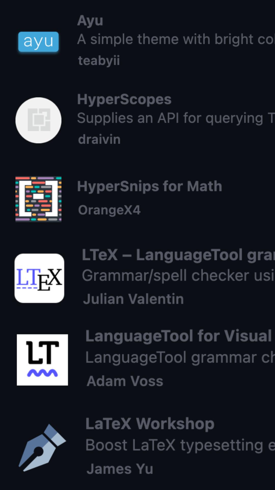

# Latex snippets

Latex snippets for vscode

## Extensions necessary

Ayu is not necessary but its the theme I like.
- HyperScopes
- HyperSnips for Math (this one works together with HyperScopes to have snippets)
- LanguageTool for Visual Studio Code (to check spelling)
- LaTeX Workshop (this essential to be able to use LaTeX in vscode)
- LTeX (checks spelling and supports LaTeX)

## How to install snippets

Press <kbd>⌘</kbd> + <kbd>⇧</kbd> + <kbd>P</kbd> in VScode and select:

Paste the file `latex.hsnips`found in this repository.

## Enjoy a fast workflow

This is a sample gif of creating a document and an equation using the snippets.

